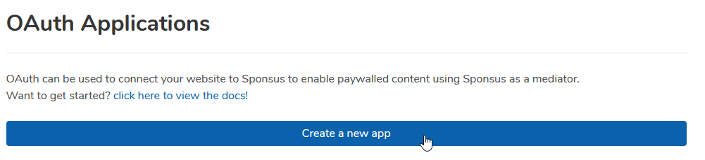
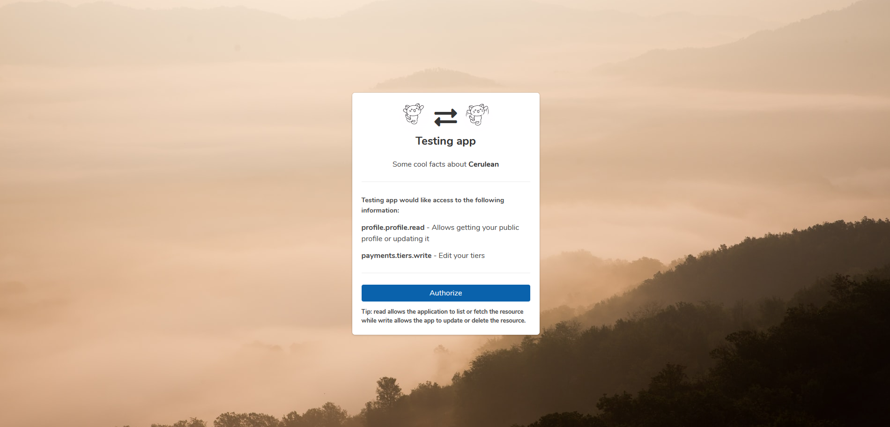

# Getting logged in

## Method 1: API Keys

API keys are the main way that you would authenticate with the API if you were creating integrations for a single creator. These keys are restricted to the creator only so if you plan to offer the integration to the public, you should use OAuth.

To get started, you should to go [this page](https://sponsus.org/developers/keys) and follow the on screen instructions for creating a key. Once you have your key, you can use it to authenticate as you with the API by using it in the `Authorization` header like this:



```bash
curl -H "Authorization: APIKeyGoesHere" https://api.sponsus.org/v1/profiles/@me
```



```python
import aiohttp
import asyncio

APIKey = "APIKeyGoesHere"

# AsyncIO is the future of Python ✨

async def main():
    client = aiohttp.ClientSession(loop=asyncio.get_event_loop())
    
    headers = {
        "Authorization": APIKey
    }
    
    async with client.get("https://api.sponsus.org/v1/profiles/@me") as response:
        my_profile = await response.json()
        
    # do things with my_profile!
    
asyncio.run(main())
```



## Method 2: OAuth

To get started, you first need to create an OAuth application by [going here](https://sponsus.org/developers/oauth).



Once you have followed the instructions, you should have both an client ID and a client secret. These are both essential for OAuth to work so make sure you save them in a secure place. If you leak the client secret, people will be able to authenticate as your app which will lead to _a lot of bad things_ happening.

With the client ID, you can send your users to a special URL on our domain. We have a generator for picking out what scopes you want to have access to on the page where you create your app. In the below example, the scopes picked will allow you to see who the user is as well edit the users tiers but **you should replace them with the scopes you wish to request**.

```text
GET https://sponsus.org/oauth/authorize
    ?response_type=code
    &client_id=<clientID>
    &redirect_uri=<one of your redirect URIs listed in your app>
    &scope=profile.profile.read payments.tiers.write
```

You should redirect the user to this page when you need them to authorize your app.



Once the user authorizes the app on our website, they will be redirected back to the redirect\_uri field. Sponsus will redirect the user with special uri params that allow you to authorize the user on your end. **You will need a method of fetching these params and sending them to a server as we do not support inline authorization, for example authorizing directly on the front end such as single-page applications.**

Now that you have the code param from the redirect, you need to send a request to our API to tell us that you have got the token and everything is in order. Our response will give you the actual OAuth key needed for using the API.


In accordance with RFC 6749, the token URL only accepts a content type of x-www-form-urlencoded. JSON content is not permitted and will return an error.


```text
POST https://api.sponsus.org/v1/oauth/token
    code=<code param from step 3>
    &grant_type=authorization_code
    &client_id=<client ID>
    &client_secret=<client secret>
    &redirect_uri=<redirect_uri that was used in step 2, important for anti fraud!>
```

If your request was successful, the API will respond with your access token as well as a refresh token that can be used to re-up the token when it has expired:

```javascript
{
    "access_token": "oa2_3AQQoI56Z1CEDC7F3SVjfkQ892AV",
    "refresh_token": "oa2r_Vm8hrWGtkgNEVqKDRVt9bv1Ff6ib",
    "scope": [
        "profile.profile.read",
        "payments.tiers.write"
    ],
    "expires_in": 2592000,
    "success": true
}
```

With the new access token, we can use this to use the API like normal:




```python
import requests

headers = {
    "Authorization": "OAuthTokenGoesHere"
}

current_logged_in_user = requests.get(
    "https://api.sponsus.org/v1/profiles/@me",
    headers=headers
)
```



