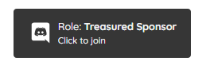

# Getting your Discord rewards

## Step 1: Sponsor a creator with Discord rewards

To get Discord rewards, you should ensure the creator you are sponsoring has Discord rewards to give. You can make sure by going to their profile and looking for a button similar to this:

Once you have synced your account to Sponsus, you will not have to do this every time. The bot will automaticly give you your roles when you donate or sponsor someone.

## Step 2: Connecting your Discord account to Sponsus

Once you are sponsoring, you can connect your Discord to Sponsus so that SponsusBot can reward you for being amazing! To get started with syncing your account, you should go to your dashboard and click "socials". You can also just [click here](https://sponsus.org/dashboard/socials/discord). Once you arrive back to Sponsus, please continue reading as you need to get the roles.

#### Resyncing your rewards on the dashboard

To resync via the dashboard, you should go to payments -&gt; manage sponsorships and then click the resync button. This will automagicly give you all the roles you paid for.

#### Resyncing in Discord

If you send s.resync in a channel where the bot can see you this will trigger a resync of your roles. This will also give you an update log so you can spot any issues with the roles.

