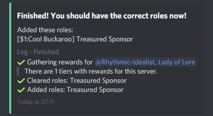

# Getting your Discord rewards

## Step 1: Sponsor a creator with Discord rewards

To get Discord rewards, you should ensure the creator you are sponsoring has Discord rewards to give. You can make sure by going to their profile and looking for a button simular to this:

## Step 2: Connecting your Discord account to Sponsus

Once you are sponsoring, you can connect your Discord to Sponsus so that SponsusBot can reward you for being amazing! Go to this page to get started. As soon as you have connected your account you should either type `s.resync` in the Discord server with the rewards \(make sure to do it in a channel where the bot can see you\) or by going to your sponsorship dashboard and clicking "resync rewards".

If you have already synced your account to Sponsus, you will not have to do this every time. The bot will automaticly give you your roles now that Sponsus knows who you are on Discord.

To resync via the dashboard, you should go to payments -&gt; manage sponsorships and then click the resync button. This will automagicly give you all the roles you paid for.

If you send a message, you will get an update log as to the progress of your roles:

