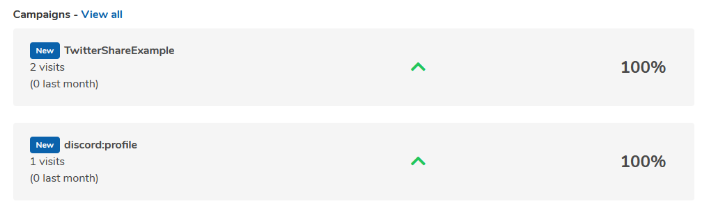

# Understanding your analytics

### What are campaigns?

Campaigns are a marketing term for a collection of social media posts. Think of it like a grouping mechanism so you can quickly see how effective your sharing was. You can post a link ending with `?utm_source=your-campaign-name` and it will track how many people viewed your profile/post with that campaign. You can put whatever you wish as the name, so long as its not too long.

In the example below, when a user clicks the link they will trigger the campaign counter to go up by 1. If the campaign is new, it will be marked as such in the dashboard.

```text
https://sponsus.org/u/cerulean?utm_source=TwitterShareExample
```



#### Default campaigns

Sometimes, Sponsus will use campaigns to help with internal statistics. If you see a campaign that you dont recognise, it is most likely an internal campaign. The best example is the Discord bot. It will send users who are interested to your profile with a campaign of `discord:profile`.

### Why cant I see all of my traffic?

User privacy is one of our core values. Because of this, our analytics suite does not track people who have set the "Do Not Track" feature on most browsers or have installed adblocking software. Unfortunately, because of this your analytics may be off by 5-10%. If you want to get a more accurate number of visits, it is a good idea to consider adding 10% to the final number to account for this blind spot.

