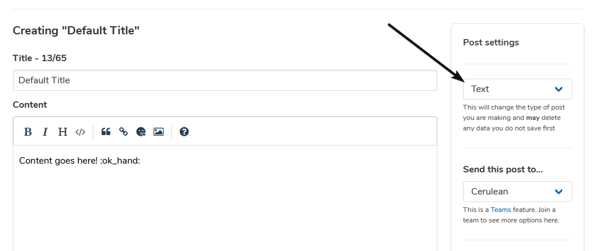

# Writing good looking posts


This guide is still being written so if you have anything you wish to add, feel free to edit it by clicking the button on the right.


Writing posts that look good is as easy as pie with Sponsus. There are some small caveats that need to be addressed however as well as some notes on how to actually write the content. But once you finish this guide, you will be ready to rock on Sponsus!

### Types of post

Sponsus supports multiple different types of post where each one has a different layout designed to make the featured content look the best. The default type is "text" which is just the content of the post. The other types are image, video, and poll.

To change the post type you can click this dropdown and select the type:



#### Image posts

This are the second most popular type of post on Sponsus as it allows you to feature 1 or more images on your feed as well as still give you access to write a full length text post. When creating an image post, you will be given the option of adding images under the content segment. Here you can select some images to use in the gallery or just one to feature the single image.

#### Video posts

Video posts work the same as image posts however they are limited to 1 video per post. If you wish to embed more, you can use the image syntax with a Youtube or Vimeo link to create a video inside the post's content.

#### Audio posts

This allows you to feature an audio file with the options of selecting a cover image, background and more. This one is pretty straight forward as to what it does.

### On the subject of images

Images on Sponsus are unique to some platforms as we have a few more features that other Markdown websites dont support. The first big note is that images look best when they are on their own line. This means seperating the image with empty lines above and below it. This means that the post will center and resize the image to look best on any device that views your wonderful post. An example of the recommended spacing:

```text
Dogs are pretty rad. Heres a dog to prove it:


Some more stuff about how cool dogs are.
```

When you insert images, Sponsus will push the image to be on its own line however you can position the image as you like.

Another important factor about images on Sponsus is that you can annotate images by adding text between the square brackets. In our example above, the text "A dog pic, so adorable!" will show up below the image.

